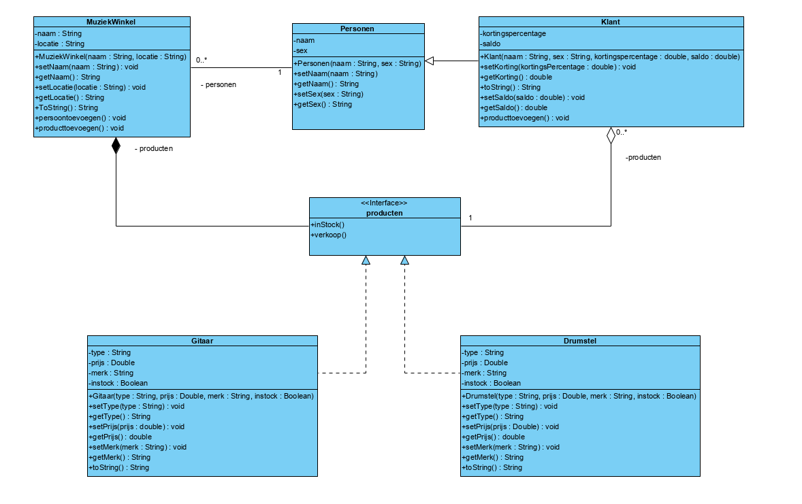

# Domain_Design_Implementatie
 Repository voor de eerste summatieve opdracht van het vak adaptive programming

## De opdracht

Ontwerp en implementeer het domein van een softwareapplicatie naar keuze. 
Je maakt een UML klassendiagram en implementeert vervolgens deze klassen met hun interne logica en functionaliteit. 
Schrijf ook een main-programma dat verschillende objecten aanmaakt op basis van de klassen uit je domein en test of alle functionaliteit werkt. 
Houd je aan de code-standaarden van de taal waarin je programmeert.

## Wat zit in de Repository
In deze repository vindt je alles van de summatieve opdracht Domain Design & Implementatie
IN de UML vindt U een klasse diagram dat gemaakt is in Visual Paradigm. 
U vindt helaas geen commits in deze repository omdat ik eerst de opdracht heb gemaakt en daarna de repository aan heb gemaakt.

## Hoe het werkt

Om te starten heb ik een klasse diagram gemaakt. Hier heb ik misschien wel het meeste van tijd aan besteed.
Zodra het UML af was het makkelijk om te starten, omdat je alles laat genereren en dan alleen nog de functies hoeft uit te schrijven.

Voor mijn opdracht heb ik gekozen voor een muziekwinkel.

De muziek winkel is het domain, waar in ik een interface heb voor de producten van de winkel en een super class voor de personen. Voor uitbreiding redenen.
Bijvoorbeeld als je werknemers zou willen toevoegen. Die hebben namelijk ook standaard een naam en een gender.
Onder de interface zitten twee klassen namelijk verschillende producten in de muziekwinkel (gitaar/drumstel).
Onder de super class "personen" zit een class "klant".
De klant kan producten kopen. Met een saldo en een kortingspercentage. Als een klant een product heeft gekocht wordt het product ook toegevoegd aan de klant.
Zodra een klant te weinig saldo heeft of het product is gekocht door een andere klant kan het product niet gekocht worden.

# UML
Om het makkelijk te maken
